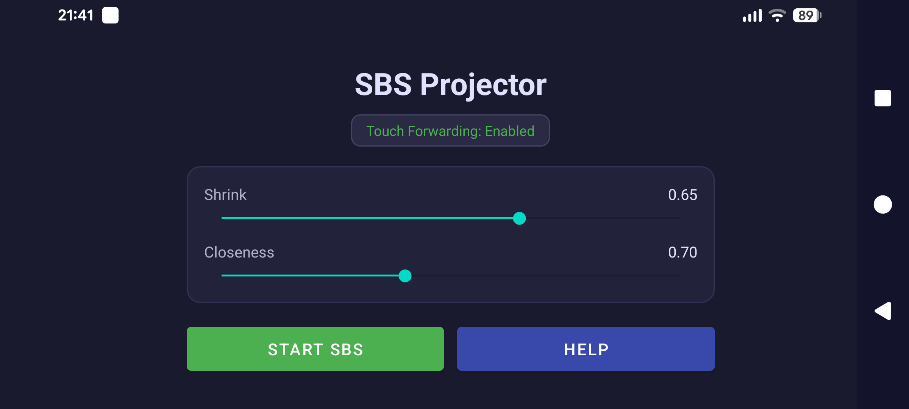
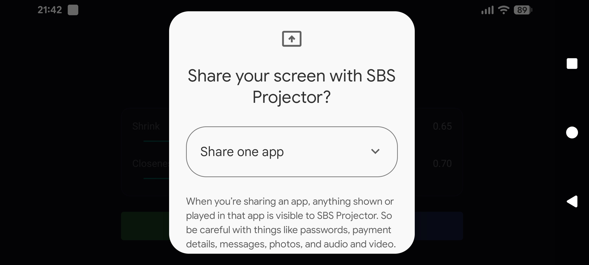
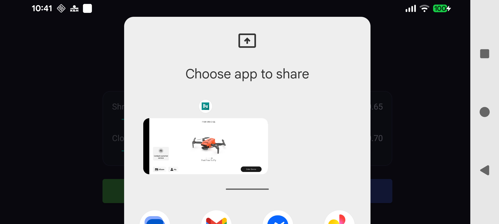
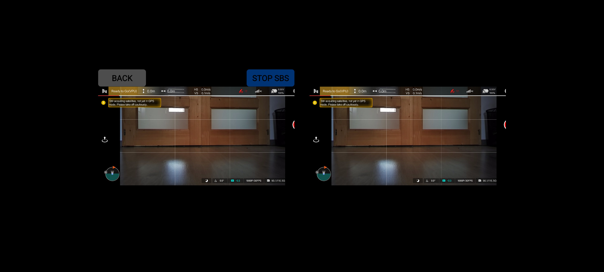

# SBS Projector

Project any Android app into a side-by-side (SBS) view for use with phone-based VR headsets like Google Cardboard. Whether you want to watch a movie, fly a drone, or play a game in VR, SBS Projector turns any 2D Android app into a VR experience without modifying the app itself.

---

## Table of Contents

- [Summary](#summary)
- [Build and Install](#build-and-install)
- [User Guide](#user-guide)
- [Technical Overview](#technical-overview)

---

## Summary

SBS Projector works as a transparent overlay. It captures the screen in real time using the Android MediaProjection API, renders the captured content twice side by side (once for each eye), and projects this full-screen overlay on top of whatever app you are running. Because it operates at the system level, it works with any app without requiring root.

**Key features:**

- Works with any Android app: games, video players, drone controllers, browsers
- Adjustable stereo geometry: scale (shrink) and distance (closeness)
- Touch-through: the SBS overlay is interactive. It means taps and swipes are transparently forwarded to the underlying app
- In-overlay controls: BACK and STOP SBS buttons accessible while wearing a headset, using a wireless or wired mouse
- Foreground service with wake lock keeps the screen on during extended use

**Requirements:**

- Android 8.0 (API 26) or newer
- A phone-based VR headset (Google Cardboard or compatible)

---

## Build and Install

### Prerequisites

- Android Studio Ladybug or newer (supports AGP 8.7+)
- Android SDK with API level 36 installed
- JDK 17
- A physical Android device running Android 8.0 or newer (the emulator does not support MediaProjection)

### Build steps

1. Clone the repository:

   ```
   git clone <repository-url>
   cd sbs-projector
   ```

2. Open the project in Android Studio, or build from the command line:

   ```
   ./gradlew assembleDebug
   ```

   The APK will be produced at:

   ```
   app/build/outputs/apk/debug/app-debug.apk
   ```

3. To build a release APK:

   ```
   ./gradlew assembleRelease
   ```

   Note: ProGuard/R8 minification is disabled in release builds. Configure signing in `app/build.gradle` before distributing.

### Install

Connect your device with USB debugging enabled, then:

```
adb install app/build/outputs/apk/debug/app-debug.apk
```

Or use Android Studio's Run button to build and install in one step.

### Permissions

On first launch the app will guide you through granting three permissions:

1. **Post notifications** - Required on Android 13+ to show the persistent service notification.
2. **Display over other apps** - Required to draw the SBS overlay on top of other apps.
3. **Screen capture** - Shown as a system consent dialog each time SBS is started - select "Share one app".

Additionally, you must enable the **SBS Projector Accessibility Service** in system Settings. The main screen shows the current status and links directly to the Settings page.

---

## User Guide



### Initial setup

When you open the app for the first time:

- You will probably see the status button at the top warning you "Touch forwarding disabled - tap to enable". Tap it, it will open the Android Accessibility Settings. Find "SBS Projector" in the list and enable it. Return to the app.

You only need to do this once. The accessibility service stays enabled until you manually disable it.

### Starting SBS projection

1. First, it's recommended to start the app you want to project (eg. Fimi Mini Navi) before starting the projection
2. Start SBS Projector, tap **Start SBS**.
   - allow to "send notifications" when prompted (need to do only once)
   - grant "display over other apps" permission when prompted (need to do only once)
3. The system will show a consent dialog asking whether to share the whole screen or a single app.

   

   Leave the select box as it is (**Share one app**), do NOT choose "Entire screen".
   
   Tap Next and select the app you want to project from the picker that follows.

   

4. The main screen closes and the SBS overlay activates over the chosen app.
5. Put your phone in the VR headset. Connect a wireless or wired mouse if you need to operate on the app while using the VR headset.



### Using the overlay

While the SBS overlay is active:

- Taps and swipes are forwarded transparently to the app running behind the overlay, so you can interact with the projected app normally.
- The **BACK** button at the top of the overlay triggers the Android back action.
- The **STOP SBS** button at the top of the overlay ends the projection and returns you to normal single-screen view.

### Stopping projection

Tap the **STOP SBS** button in the overlay. The foreground service will stop, the overlay will be removed, and the screen capture session will end.

### Configuring

Two sliders control how the stereoscopic image is rendered:

- **Shrink** - Scales the projected images. Increase this if the image feels too wide inside the headset, or if you see barrel distortion from the lenses.
- **Closeness** - Controls the distance of the two half-projections. Adjust it to see the content clearly according to your eye distance, VR and phone screen dimensions.

These settings are saved automatically and restored the next time you open the app.

---

## Technical Overview

This section describes the internal architecture for developers who want to understand, modify, or extend the app.

### Project structure

```
app/src/main/
  java/com/nlacsoft/sbsprojector/
    MainActivity.kt             - Permission orchestration and settings UI
    SbsOverlayService.kt        - Foreground service: owns overlay window and capture session
    SbsAccessibilityService.kt  - Accessibility service: gesture injection and trusted overlay window
    SbsSurfaceView.kt           - SurfaceView: SBS rendering, touch coordinate transform
    ScreenCaptureManager.kt     - MediaProjection pipeline: VirtualDisplay -> ImageReader -> Bitmap
  res/
    layout/activity_main.xml
    xml/accessibility_service_config.xml
```

### Screen capture pipeline

`ScreenCaptureManager` drives the capture loop:

1. The user consents to screen recording. `MainActivity` receives the `MediaProjection` token and passes it to `SbsOverlayService`.
2. An `ImageReader` is created with format `RGBA_8888` and `maxImages=2` (double buffering for low latency).
3. A `VirtualDisplay` is created from the `MediaProjection` and pointed at the `ImageReader` surface. The `AUTO_MIRROR` flag is intentionally omitted to avoid a feedback loop when the overlay itself is visible.
4. Frame callbacks run on a dedicated background thread (`SbsCaptureThread`) to keep the main thread free.
5. Each callback wraps the `Image` buffer as a zero-copy `Bitmap` and calls `SbsSurfaceView.drawSbsFrame()`.

### SBS rendering geometry

`SbsSurfaceView` splits the full-screen canvas into two equal halves and draws the captured bitmap into each half using `Canvas.drawBitmap`.

For each half:

1. **Crop** - Insets matching camera cutout (left) and navigation bar (right) are removed from the source rectangle using `DisplayInsets`.
2. **Letterbox** - The cropped source is fitted into the half-screen panel while preserving aspect ratio, producing a destination `RectF`.
3. **Shrink** - The destination rect is uniformly inset by a user-controlled fraction, scaling the content away from the panel edges.
4. **Closeness** - The destination rect is horizontally offset toward the center of the screen. For the left eye the rect shifts right; for the right eye it shifts left. The magnitude is proportional to `(1 - closeness)` times the quarter-screen width, creating the effect of stereo convergence.

A 2-pixel vertical divider is drawn at the center of the screen to help with headset alignment.

### Touch forwarding

Transparently forwarding input from a full-screen overlay to the app underneath requires working around two Android restrictions:

- **Trusted overlay requirement (Android 12+):** Gesture injection via `AccessibilityService.dispatchGesture` only works reliably when the overlay window uses `TYPE_ACCESSIBILITY_OVERLAY`, which is only available to accessibility services. A standard `TYPE_APPLICATION_OVERLAY` window results in injected events being flagged as obscured and ignored by some apps.

- **Self-touch conflict:** If the overlay window is touchable, touch events hit the overlay instead of being delivered to the app. The overlay cannot simply be made permanently non-touchable because the BACK and STOP SBS buttons must remain interactive.

The solution:

1. `SbsAccessibilityService` owns the overlay window (not the foreground service). This grants it `TYPE_ACCESSIBILITY_OVERLAY` and a trusted context for gesture injection.
2. When a touch event arrives on the overlay and is not a button tap, the overlay sets `FLAG_NOT_TOUCHABLE` on its own window, waits 100 ms for the input dispatcher to see the updated flags, injects the translated gesture, then clears `FLAG_NOT_TOUCHABLE` in the gesture completion callback.

Touch coordinate translation:
- Determine which eye panel (left or right) the touch falls in.
- Map the touch position from overlay coordinates to the source screen coordinates by reversing the letterbox and shrink transforms stored in the last rendered `Geometry` snapshot.

### Service and threading model

| Component | Thread | Responsibility |
|---|---|---|
| `MainActivity` | Main | Permission flow, slider UI, starting service |
| `SbsOverlayService` | Main | Window management, wake lock, MediaProjection token |
| `SbsAccessibilityService` | Main | Accessibility callbacks, window flags, gesture dispatch |
| `SbsSurfaceView.drawSbsFrame` | SbsCaptureThread | Canvas lock/draw from capture thread |
| `ScreenCaptureManager` callbacks | SbsCaptureThread | Image acquisition, bitmap wrapping |
| Gesture injection delay | Main (Handler) | 100 ms post to main handler before inject |

### Build configuration

| Property | Value |
|---|---|
| compileSdk / targetSdk | 36 (Android 16) |
| minSdk | 26 (Android 8.0) |
| AGP version | 8.7.3 |
| Kotlin version | 2.2.20 |
| Java compatibility | 17 |

Key dependencies: `androidx.core:core-ktx`, `appcompat`, `material`, `constraintlayout`, `lifecycle-service`.

### Extending the app

**Adding barrel distortion correction:** `SbsSurfaceView` draws to a `Canvas`. Replacing the canvas-based rendering with an OpenGL ES pipeline would allow applying lens distortion correction shaders, which is the main quality improvement available for a future version.

**Supporting different headset IPDs:** The closeness slider approximates IPD adjustment. A more accurate implementation would parameterize the eye separation in actual millimeters given the device's physical screen dimensions.

**Android version compatibility:** `minSdk` is set to 26 (Android 8.0). The app uses runtime API version checks to handle differences across versions:
- On Android 8.x–9 (API 26–28): foreground service runs without a typed service declaration; display cutout mode is not applied.
- On Android 9 (API 28–29): display cutout uses `LAYOUT_IN_DISPLAY_CUTOUT_MODE_SHORT_EDGES` as a fallback.
- On Android 10+ (API 29+): foreground service is started with `FOREGROUND_SERVICE_TYPE_MEDIA_PROJECTION`.
- On Android 11+ (API 30+): window metrics and insets are read via `WindowManager.currentWindowMetrics`; display cutout uses `LAYOUT_IN_DISPLAY_CUTOUT_MODE_ALWAYS`.
- On Android 12+ (API 31+): `FOREGROUND_SERVICE_MEDIA_PROJECTION` manifest permission is required and declared.
- On Android 13+ (API 33+): `POST_NOTIFICATIONS` runtime permission is requested.
